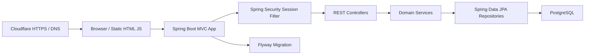
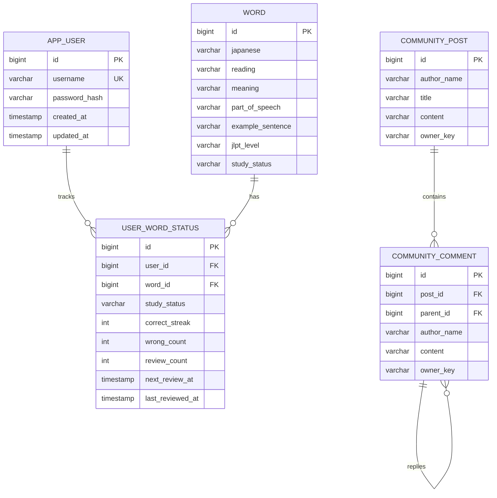

# JLPTCloud

JLPTCloud is a deployed Japanese learning web service for JLPT learners. It combines a vocabulary browser, grammar note management, study progress tracking, scheduled reviews, and an authenticated community board.

- Live service: https://jlptcloud.com
- Backend: Java 21, Spring Boot 4, Spring Web MVC, Spring Data JPA
- Database: PostgreSQL for production, H2 only for local/test profiles
- Deployment: Docker Compose, Cloudflare, Flyway database migrations

## Overview

The service is built as a portfolio project to demonstrate backend design, security hardening, deployment awareness, and maintainable CRUD-plus-domain logic.

The core idea is simple: JLPT learners need more than a static word list. They need to search vocabulary by level, track their personal learning state, review weak words at the right time, store grammar patterns, and ask questions in a small community space.

## Why I Built This

Many beginner portfolio projects stop at "board + login + CRUD." I wanted JLPTCloud to show a more realistic service shape:

- public read APIs and authenticated write APIs
- user-specific study progress over shared vocabulary data
- review scheduling instead of a flat status field only
- production and local profiles separated
- schema migration and database validation for deployment
- tests for security boundaries and user-specific behavior

## Main Features

### Vocabulary

- JLPT N5-N1 vocabulary list loaded from CSV seed data
- filter by JLPT level and study status
- keyword search by Japanese word, reading, or meaning
- user-specific study status: `NEW`, `LEARNING`, `REVIEW_NEEDED`, `MASTERED`
- review actions: known/missed answer tracking
- spaced-review scheduling using `nextReviewAt`
- per-level progress dashboard

### Grammar Notes

- create, read, update, and delete grammar notes
- store pattern, meaning, explanation, example sentence, JLPT level, and study status
- filter grammar notes by JLPT level and study status
- write operations require authentication

### Community

- create, read, update, and delete posts
- create comments and nested replies
- edit/delete is restricted to the original authenticated writer
- read access is public; write access requires login

### Authentication

- session-based login/signup
- BCrypt password hashing
- legacy SHA-256 hash compatibility with automatic rehash on login
- Spring Security path-based authorization
- JSON unauthorized/forbidden responses for API clients

## Architecture



### Package Structure

```text
com.jlptcloud
  domain
    user
    word
    grammar
    community
    study
  global
    api
    config
    entity
    exception
    security
```

## ERD



## API Design

All API responses use a common envelope:

```json
{
  "success": true,
  "data": {}
}
```

Error responses use:

```json
{
  "success": false,
  "error": {
    "code": "UNAUTHORIZED",
    "message": "Please log in first."
  }
}
```

### Auth

- `POST /api/auth/signup`
- `POST /api/auth/login`
- `POST /api/auth/logout`
- `GET /api/auth/me`

### Words

- `GET /api/words`
- `GET /api/words?jlptLevel=N2&studyStatus=LEARNING&keyword=keigo`
- `GET /api/words/{id}`
- `GET /api/words/dashboard`
- `POST /api/words`
- `PUT /api/words/{id}`
- `PATCH /api/words/{id}/status`
- `PATCH /api/words/{id}/review`
- `DELETE /api/words/{id}`

### Grammar Notes

- `GET /api/grammar-notes`
- `POST /api/grammar-notes`
- `PUT /api/grammar-notes/{id}`
- `DELETE /api/grammar-notes/{id}`

### Community

- `GET /api/community/posts`
- `GET /api/community/posts/{postId}`
- `POST /api/community/posts`
- `PUT /api/community/posts/{postId}`
- `DELETE /api/community/posts/{postId}`
- `POST /api/community/posts/{postId}/comments`
- `GET /api/community/posts/{postId}/comments`
- `PUT /api/community/comments/{commentId}`
- `DELETE /api/community/comments/{commentId}`

## Security

Security improvements implemented for portfolio review:

- Spring Security introduced
- BCrypt password hashing
- old SHA-256 hashes can be upgraded on successful login
- `/h2-console` is denied and H2 console is disabled
- production profile uses PostgreSQL and `ddl-auto=validate`
- write operations require authenticated sessions
- community post/comment edit and delete operations validate ownership
- session cookie settings include `HttpOnly`, `Secure`, and `SameSite=Lax`
- API authorization failures return JSON instead of an HTML error page

## Database And Migration

Production uses PostgreSQL with Flyway:

- migration file: `src/main/resources/db/migration/V1__init_schema.sql`
- app startup validates entity/schema consistency with `spring.jpa.hibernate.ddl-auto=validate`
- search-related indexes are added for vocabulary lookup
- user progress indexes are added for due-review queries

Local development can use H2 with the `local` profile:

```powershell
.\gradlew.bat bootRun --args='--spring.profiles.active=local'
```

## Deployment

Docker Compose starts the application and PostgreSQL:

```powershell
$env:JLPTCLOUD_DB_PASSWORD="change-this-password"
docker compose up --build -d
```

Services:

- `jlptcloud`: Spring Boot app on container port `8080`
- `postgres`: PostgreSQL 16 with a persistent Docker volume

The public domain is served through Cloudflare.

### Legacy H2 Migration

The production compose file mounts the previous H2 Docker volume at `/legacy-h2-data` and enables a one-time migration runner with `JLPTCLOUD_LEGACY_H2_MIGRATION_ENABLED=true`.

On first PostgreSQL startup, JLPTCloud copies legacy H2 data into PostgreSQL if the new database is empty:

- users
- words
- grammar notes
- community posts
- community comments
- user word statuses

If PostgreSQL already contains users or words, the migration is skipped to prevent duplicate imports. Legacy comment ownership cannot be mapped to authenticated users, so migrated comments are preserved as read-only legacy comments.

## Testing

The test suite covers:

- signup and session creation
- vocabulary pagination/filtering
- user-specific word status filtering
- unauthorized write rejection
- spaced-review scheduling
- dashboard response shape
- community comment ownership enforcement

Run:

```powershell
.\gradlew.bat test
```

If the project is stored under a Windows path with non-ASCII characters and Gradle test workers cannot resolve classpaths, map the project to an ASCII drive path before running tests:

```powershell
subst J: "C:\path\to\JLPTCloud"
J:
.\gradlew.bat clean test
subst J: /D
```

## What I Learned

- how to separate local and production database settings
- how to move from simple CRUD to user-specific domain behavior
- how to design authorization around ownership, not only login state
- how Flyway migrations make deployment more reliable than `ddl-auto=update`
- how tests reveal security regressions after adding authentication

## Future Improvements

- replace session login with OAuth2 or JWT depending on client architecture
- add admin-only vocabulary import with validation reports
- add full-text search ranking and typo tolerance
- add review notification emails or scheduled reminders
- add observability with actuator metrics and structured logs
- add CI pipeline for test/build/deploy automation
