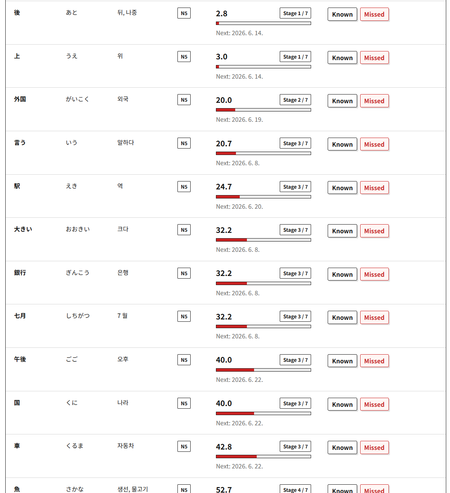
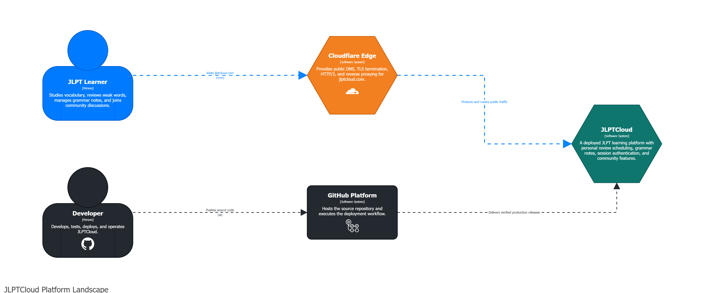
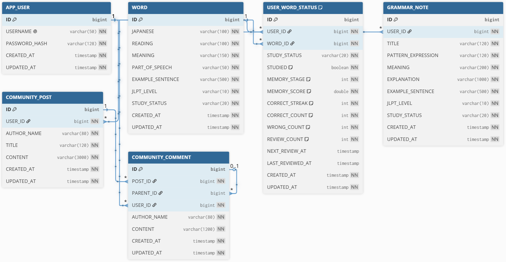

# JLPTCloud

JLPTCloud is a deployed JLPT learning service for vocabulary study, spaced review, grammar notes, and learner community discussions.

- Live service: https://jlptcloud.com
- Backend: Java 21, Spring Boot 4, Spring Web MVC, Spring Data JPA, Spring Security
- Database: PostgreSQL 16 in production, H2 for tests
- Deployment: AWS Lightsail, Docker Compose, GitHub Actions

## Overview

JLPTCloud is a deployed, personalized JLPT vocabulary review service. It helps learners decide not only what a Japanese word means, but **what they should review next**.



The learning flow is simple:

1. Browse shared vocabulary from N5 to N1.
2. Press `Studied` to add a word to a personal review queue.
3. Review the word later with `Known` or `Missed`.
4. Let the service update memory score, review stage, review count, and next review date.
5. Return to weaker words first because lower memory scores receive higher priority.

The review screen shows the Japanese word, reading, Korean meaning, JLPT level, live memory score, seven-stage progress, and scheduled review date in one place. JLPTCloud also provides grammar-note management and an authenticated community with posts, comments, and replies.

## Why I Built This

Most vocabulary applications stop after storing words and toggling a `memorized` flag. The difficult part of learning, however, is that memory is personal and changes over time. Two learners can study the same word but need to review it at completely different moments.

I built JLPTCloud to model that difference directly. Vocabulary is shared, but progress belongs to each user-word pair. A learner's answers and elapsed time continuously affect memory score, review stage, and scheduling instead of collapsing progress into a single boolean value.

That product requirement shaped the backend:

- separate shared `Word` data from personal `UserWordStatus`
- rank a review queue using memory score, scheduled date, and stable tie-breaking
- load review rows with the related `Word` data to avoid N+1 query behavior
- protect personal progress and community writes with session authentication and ownership checks
- test complete request flows with `MockMvc` and `MockHttpSession`
- run the Spring Boot application and PostgreSQL as separate production containers

## Core Problems And Solutions

### 1. Shared Words vs Personal Study Progress

**Problem**

The vocabulary list is shared by all users, but each user needs a different study state for the same word. If the study status were stored directly in the `word` table, one user's progress would affect everyone.

**Solution**

The project separates the shared `word` table from the user-specific `user_word_status` table.

- `word`: stores Japanese word, reading, meaning, part of speech, example sentence, and JLPT level
- `user_word_status`: stores each user's progress for each word

A new user initially has no rows in `user_word_status`. When the user presses `Studied`, the application creates a row for that user and word.

**Alternative Considered**

Storing status directly in the `word` table would be simpler, but it would only work for a single-user app. Storing progress as JSON in the user table was also possible, but it would make filtering, indexing, and querying review items harder.

**Result**

The service can keep one shared vocabulary database while allowing each user to have an independent review queue and memory score.

### 2. First Study vs Review Study

**Problem**

The first time a learner sees a word is different from later review sessions. Mixing first-pass study and review in one screen makes the workflow unclear.

**Solution**

The vocabulary screen is used for first-pass study. Each word has a `Studied` action. Once pressed, the word appears in the Review Words tab.

The Review Words tab then uses `Known` and `Missed` actions to update the user's memory state.

**Alternative Considered**

The first version used a direct status change such as `NEW`, `LEARNING`, `REVIEW_NEEDED`, and `MASTERED` from the vocabulary screen. That was simple, but it did not clearly separate "I studied this once" from "I reviewed this again later."

**Result**

The learning flow became easier to explain:

```text
Words tab: first pass
Review Words tab: second pass and later
```

### 3. Memory Score And Review Priority

**Problem**

A four-step enum alone cannot express how urgently a word should be reviewed. Two words can both be `LEARNING`, but one may have been reviewed yesterday and another may have been ignored for two weeks.

**Solution**

JLPTCloud uses a seven-stage review model inspired by the forgetting curve: memory becomes less reliable as time passes, so the service recalculates the current memory score when the review queue is requested.

Instead of storing only a fixed status such as `memorized`, each user-word pair keeps a memory stage, memory score, review count, last reviewed time, and next review date.

Review intervals:

```text
Stage 1: 1 day
Stage 2: 4 days
Stage 3: 7 days
Stage 4: 14 days
Stage 5: 30 days
Stage 6: 60 days
Stage 7: 90 days
```

Current memory score is calculated when the review API is called:

```text
currentMemoryScore = memoryScore * 0.7 ^ (elapsedDays / reviewIntervalDays)
```

When the user answers `Known`:

- memory stage increases by 1, up to stage 7
- memory score increases, capped at 100
- next review date is pushed further away

When the user answers `Missed`:

- memory stage decreases by 2, down to stage 1
- memory score decreases, floored at 0
- next review date is set to the next day

**Alternative Considered**

A simpler implementation could sort only by `nextReviewAt`. That would be easier to query in SQL, but it would not reflect memory decay between reviews. Another option was to persist a calculated priority score, but that would require scheduled updates or more complex consistency handling.

**Result**

The review queue can prioritize weaker words using both user answers and elapsed time.

### 4. Review Queue Data Loading And Transactions

**Problem**

The review queue screen does not show only personal progress. Each row needs shared word data such as Japanese text, reading, meaning, and JLPT level together with user-specific data such as memory score, memory stage, review count, and next review date.

If progress rows are loaded first and each word is accessed lazily one by one, the screen can fall into an N+1 query pattern. Review actions also update several fields at once, so partial updates would make the learner's state inconsistent.

**Solution**

The `UserWordStatusRepository` uses `@EntityGraph(attributePaths = "word")` for review-related queries, so user progress is loaded with the required `Word` data instead of triggering one extra lazy query per row.

Review actions such as `Known` and `Missed` are handled inside a service transaction. A single answer can update:

- memory stage
- memory score
- correct or wrong count
- review count
- last reviewed time
- next review date

**Result**

The review queue is easier to reason about: data loading is predictable, and each review answer is saved as one consistent state change.

### 5. Authentication And Ownership

**Problem**

Write operations need to be protected. It is not enough to check whether a user is logged in; update and delete operations also need to verify that the current user owns the resource.

**Solution**

The project uses session-based authentication with Spring Security.

- Passwords are hashed with BCrypt.
- The browser stores a `JSESSIONID` cookie.
- The server session stores `LOGIN_USER_ID`.
- A custom session filter reads the session and sets the Spring Security authentication context.
- Protected write APIs require authentication.
- Community post and comment update/delete operations compare the current session user id with the entity's `user_id`.

**Alternative Considered**

JWT could be used for a separate frontend/backend architecture. For this project, session authentication was simpler and appropriate because the frontend is served by the same Spring Boot application.

**Result**

Unauthenticated users can read public data, but cannot modify words, grammar notes, or community content. Community content is linked to `AppUser`, so ownership is enforced through database relationships rather than a loose string key.

### 6. Community Data Model

**Problem**

A community board needs posts, comments, replies, and ownership checks. Replies should not require a completely separate table if they share the same behavior as comments.

**Solution**

The community uses two main entities:

- `CommunityPost`
- `CommunityComment`

`CommunityComment` has:

- `post_id`: the post it belongs to
- `parent_id`: nullable self-reference for replies
- `user_id`: the authenticated writer

If `parent_id` is `null`, the row is a normal comment. If `parent_id` points to another comment, the row is a reply.

**Alternative Considered**

A separate `reply` table was possible, but it would duplicate fields and service logic. A self-referencing comment table is simpler for this level of nested discussion.

**Result**

The service supports posts, comments, nested replies, and writer-only update/delete rules with a compact schema.

## Main Features

### Vocabulary

- Browse JLPT N5-N1 vocabulary
- Filter by JLPT level and study status
- Search by Japanese word, reading, or meaning
- Mark words as `Studied` for first-pass learning
- Review studied words with `Known` and `Missed`
- Track memory stage, memory score, review count, and next review date
- Show lower-score words earlier in the review queue

### Grammar Notes

- Create, read, update, and delete grammar notes
- Store pattern, meaning, explanation, example sentence, JLPT level, and study status
- Filter by JLPT level and study status
- Require login for write operations

### Community

- Create, read, update, and delete posts
- Create comments and nested replies
- Link posts and comments to authenticated users through `user_id`
- Allow only the original writer to update or delete their content

### Security

- Session-based signup, login, logout, and current-user API
- BCrypt password hashing
- Spring Security authorization rules
- H2 console disabled
- API errors returned as JSON
- Session cookie settings include `HttpOnly`, `Secure`, and `SameSite=Lax`

## Architecture

### Platform Landscape



The diagram shows the public request path through Cloudflare and the deployment path from GitHub to the production JLPTCloud service.

### Database ERD



The schema separates shared vocabulary from user-specific study progress and links authenticated users to grammar notes, community posts, and nested comments.

### Package Structure

```text
com.jlptcloud
  domain
    community
    grammar
    study
    user
    word
  global
    api
    config
    entity
    exception
    security
```

`domain` contains feature-specific business logic. `global` contains shared infrastructure such as API response format, security configuration, exception handling, and base entity fields.

## API Design

All API responses use a common envelope:

```json
{
  "success": true,
  "data": {}
}
```

Error responses use the same shape:

```json
{
  "success": false,
  "error": {
    "code": "UNAUTHORIZED",
    "message": "Please log in first."
  }
}
```

### Auth

- `POST /api/auth/signup`
- `POST /api/auth/login`
- `POST /api/auth/logout`
- `GET /api/auth/me`

### Words

- `GET /api/words`
- `GET /api/words/{id}`
- `GET /api/words/dashboard`
- `GET /api/words/review`
- `POST /api/words`
- `PUT /api/words/{id}`
- `PATCH /api/words/{id}/status`
- `PATCH /api/words/{id}/study`
- `PATCH /api/words/{id}/review`
- `DELETE /api/words/{id}`

### Grammar Notes

- `GET /api/grammar-notes`
- `GET /api/grammar-notes/{id}`
- `POST /api/grammar-notes`
- `PUT /api/grammar-notes/{id}`
- `DELETE /api/grammar-notes/{id}`

### Community

- `GET /api/community/posts`
- `GET /api/community/posts/{postId}`
- `POST /api/community/posts`
- `PUT /api/community/posts/{postId}`
- `DELETE /api/community/posts/{postId}`
- `GET /api/community/posts/{postId}/comments`
- `POST /api/community/posts/{postId}/comments`
- `PUT /api/community/comments/{commentId}`
- `DELETE /api/community/comments/{commentId}`

## Testing

The project uses Spring Boot tests with MockMvc. The tests send HTTP-like requests through the Spring MVC layer without manually starting a browser or external server.

Covered cases include:

- signup creates a session and returns the normalized username
- vocabulary list supports JLPT level filtering and pagination
- unauthenticated users cannot modify word state or create words
- authenticated users can mark words as studied
- studied words appear in the review queue
- review answers update memory score, review count, and next review date
- lower memory score words are prioritized in the review queue
- community comments can only be deleted by their original writer

Run tests locally:

```powershell
.\gradlew.bat test
```

## Deployment

The service is deployed to AWS Lightsail with Docker Compose.

```text
GitHub push to main
-> GitHub Actions runner starts
-> repository checkout
-> Java 21 setup
-> ./gradlew clean bootJar
-> app.jar is uploaded to the Lightsail server
-> Docker Compose rebuilds and restarts the app
-> smoke checks verify / and /api/words
```

Docker Compose runs two containers:

- `jlptcloud`: Spring Boot application container
- `postgres`: PostgreSQL 16 database container

Important port settings:

```text
Host port 80 -> Spring Boot container port 8080
Spring Boot -> PostgreSQL at postgres:5432 inside the Docker network
```

Sensitive values such as the Lightsail SSH key and database password are stored in GitHub Actions Secrets and injected during deployment.

## Current Limitations

- The GitHub Actions workflow currently builds and deploys the application, but test execution is not yet used as a deployment gate.
- Review queue scoring is calculated in Java memory after loading the user's studied words. This is acceptable for the current portfolio scale, but should be optimized for larger datasets.
- The frontend is a static HTML/CSS/JavaScript application served by Spring Boot, so it is simple but less modular than a modern SPA.
- Session data uses the default server-side session approach. For multi-instance deployment, an external session store such as Redis would be needed.

## Future Improvements

- Add `./gradlew clean test` to GitHub Actions before deployment
- Optimize review queue queries with database-side filtering for due items
- Add admin CSV import with validation reports
- Add more focused unit tests for the memory score algorithm
- Add observability with Spring Actuator metrics and structured logs
- Add richer community features such as search, likes, and moderation

## What I Learned

- A useful learning service needs user-specific state, not only shared master data.
- Ownership checks should be based on authenticated user relationships, not request text.
- A review system is easier to explain when first study and later review are separated.
- Docker Compose makes it clear how the app container and database container communicate.
- MockMvc is useful for testing session-based API behavior without starting a full external server.
